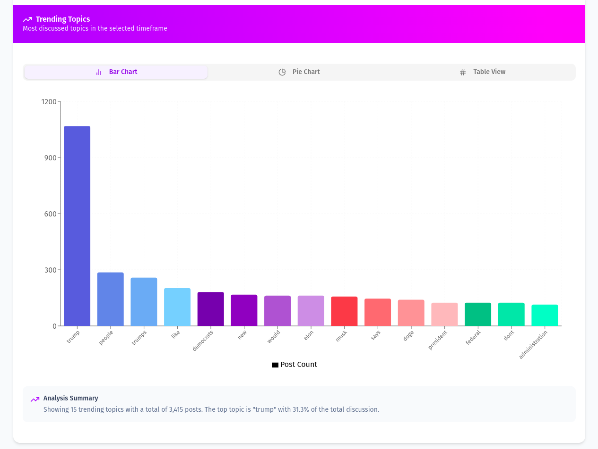

# Research Engineering Intern Assignment

# Social Media Analyzer


## Introduction

The **Social Media Analyzer** is a powerful tool designed to analyze social media interactions, focusing on Reddit datasets. The system processes large volumes of data to extract insights, trends, and user behavior patterns using advanced AI models, Graph RAG, and AI-powered analysis.

The project is structured into two main components:

- **Client**: Frontend interface for visualization and interaction.
- **AI Server**: Backend processing using NLP, Graph RAG with Neo4j, and AI analysis.

## Features

- **Chatbot powered by Llama3-8B**: Refines user queries and generates responses based on an optimized prompt.
- **Graph RAG with Neo4j AuraDB**: Extracts insights using network analysis with NetworkX and Neo4j.
- **Time Series Data Analysis**: Displays user engagement over time.
- **Community Distribution Analysis**: Identifies the most engaged posts within social communities.
- **Topic Trends Detection**: Determines trending topics based on the provided query.
- **Network Graph Visualization**: Generates an interactive visualized graph from Neo4j and provides a summarized analysis.
- **AI-powered Analysis**:
  - Identifies **Main Themes**
  - Extracts **Key Points**
  - Determines **Overall Sentiment**
  - Highlights **Notable Patterns**
- **Interactive Dashboard**: Built with Next.js for an engaging and responsive user experience.

## System Architecture


## Folder Structure

```
├── client/          # Frontend application
│   ├── app/         # Application components and pages
│   ├── components/  # Components of social media analyzer
│   ├── utils/       # Backend API connection
│   └── package.json # Frontend dependencies
├── ai-server/       # Backend AI server
│   ├── services/    # Where services code is placed
│   ├── data/        # jsonl and processed_json data
│   ├── scripts/     # Neo4j script for inserting data in the Neo4j AuraDB
│   └── main.py      # Entry point and FastAPI routes
├── images/          # System architecture and UI screenshots
└── README.md        # Project documentation
```

## Installation

### Prerequisites

Ensure you have the following installed:

- **Node.js > 20** (for client and API server)
- **Python 3.11.11** (for AI processing)
- **Neo4j** (for Graph RAG processing)
- **FastAPI** (for backend REST API)

### Setup

#### 1. Clone the Repository

```sh
git clone https://github.com/sameer240704/research-engineering-intern-assignment-sameer-gupta.git
```

#### 2. Install Dependencies

##### Client

```sh
cd client
npm install
```

##### AI Server

```sh
cd ../ai-server
python -m venv venv
source venv/bin/activate  # On Windows use `venv\Scripts\activate`
pip install -r requirements.txt
```

#### 3. Run the Application

##### Start AI Server

```sh
cd ai-server
uvicorn main:app --host 0.0.0.0 --port 8000
```

##### Start Client

```sh
cd ../client
npm run dev
```

## Usage

1. Open the web application at `http://localhost:3000`
2. Enter your query or let the chatbot refine your query.
3. Click on the **Analyze** button after adding filters.
4. View insights on **Time Series Trends, Community Distribution, and Topic Trends**.
5. Explore **Network Graph** relationships between users and topics.
6. Check **AI-powered analysis**, including themes, key points, sentiment, and patterns.
7. Analyze social media engagement through dynamic charts and reports.

## Screenshots

### Dashboard View


### Graph RAG Visualization


### Topic Trends Analysis



### Network Graph Summary


### AI Analysis


### Llama Chatbot


## Contributing

Feel free to contribute by opening issues or submitting pull requests!

## License

This project is licensed under the MIT License.

---

**Author:** [Sameer Gupta](https://github.com/sameer240704)
